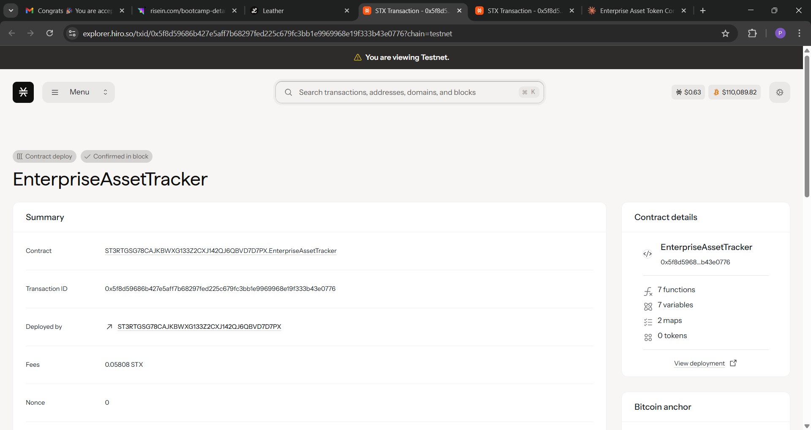

# Enterprise Asset Tracker

## Project Description

The Enterprise Asset Tracker is a comprehensive blockchain-based solution built on the Stacks network using Clarity smart contracts. This system enables organizations to efficiently track, manage, and monitor their corporate assets across multiple locations while maintaining detailed records of maintenance schedules, depreciation calculations, and asset lifecycle management.

The smart contract provides a decentralized, tamper-proof ledger for asset management, ensuring transparency, accountability, and accurate historical tracking of all corporate assets. Organizations can register assets, update their maintenance records, track depreciation over time, and manage asset locations - all through secure blockchain transactions.

## Project Vision

Our vision is to revolutionize enterprise asset management by leveraging blockchain technology to create a transparent, efficient, and secure asset tracking ecosystem. We aim to:

- **Eliminate Asset Loss**: Provide real-time visibility into asset locations and status across all corporate facilities
- **Optimize Maintenance Operations**: Enable proactive maintenance scheduling to extend asset lifespan and reduce operational costs  
- **Ensure Compliance**: Maintain immutable audit trails for regulatory compliance and financial reporting
- **Reduce Administrative Overhead**: Automate depreciation calculations and maintenance tracking to minimize manual processes
- **Enable Data-Driven Decisions**: Provide comprehensive asset analytics for informed capital allocation and replacement planning

By building on blockchain technology, we ensure that asset records are permanently preserved, easily auditable, and accessible to authorized stakeholders while maintaining the highest levels of security and data integrity.

## Future Scope

The Enterprise Asset Tracker project has extensive potential for expansion and enhancement:

### Advanced Features
- **IoT Integration**: Connect with IoT sensors for real-time asset monitoring, location tracking, and condition assessment
- **Mobile Applications**: Develop mobile apps for field technicians to update asset status, perform inspections, and scan QR codes
- **Advanced Analytics Dashboard**: Create comprehensive reporting and analytics platform with predictive maintenance capabilities
- **Multi-Chain Support**: Expand to other blockchain networks for increased interoperability and reduced transaction costs

### Enhanced Functionality  
- **Asset Categories & Templates**: Pre-configured templates for different asset types (vehicles, equipment, IT assets, etc.)
- **Workflow Automation**: Automated approval workflows for asset transfers, disposals, and high-value purchases
- **Integration Capabilities**: APIs for integration with existing ERP, CMMS, and accounting systems
- **Asset Tokenization**: Convert physical assets into tradeable digital tokens for fractional ownership and investment

### Compliance & Security
- **Regulatory Compliance Modules**: Built-in compliance checking for industry-specific regulations (ISO 55000, FASB, etc.)
- **Advanced Access Controls**: Role-based permissions with multi-signature requirements for critical operations  
- **Audit Trail Enhancement**: Detailed logging and reporting for all asset-related activities and changes
- **Data Privacy Features**: Zero-knowledge proofs for sensitive asset information while maintaining transparency

### Scalability Improvements
- **Layer 2 Solutions**: Implementation of scaling solutions for high-volume enterprise deployments
- **Batch Processing**: Bulk asset operations for large-scale deployments and data migrations
- **Performance Optimization**: Enhanced query capabilities and caching for faster asset lookups and reporting

## Contract Address Details

contract ID : ST3RTGSG78CAJKBWXG133Z2CXJ142QJ6QBVD7D7PX.EnterpriseAssetTracker

**Testnet Deployment:**
- Network: Stacks Testnet
- Contract Address: [To be added]
- Contract Name: [To be added]
- Deployment Block: [To be added]
- Deployment Transaction: [To be added]

** Deployment Instruction:**
- Network: Stacks Mainnet  
- Contract Address: [To be added]
- Contract Name: [To be added]
- Deployment Block: [To be added]
- Deployment Transaction: [To be added]

---